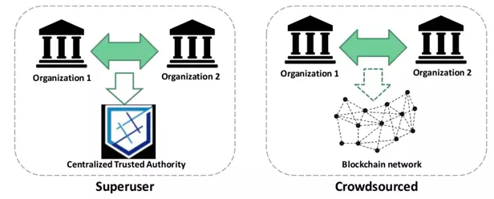
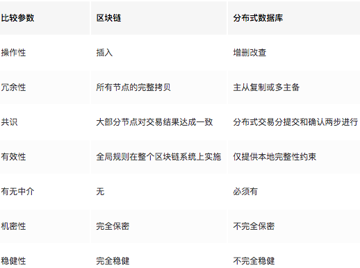

# 什么是区块链

是一种软件协议，是由许多包含信息的区块组成的链条，区块链技术通过给数字信息标记时间戳，使其无法回溯或篡改。
2008 年，第一个加密货币比特币才出现，同时引入了现代区块链技术，最初，区块链是以比特币的底层技术出现的，
    各种区块链分叉导致发生了很大的变化。
区块链有时候被用于指比特币区块链，以太坊区块链或其它虚拟货币、数字代币，但通常情况下是指分布式账本。

## Why
```text
弹性恢复
	区块链通常是冗余型的架构
	即便在系统遭受大规模攻击的情况下，多数节点依然可用
高效率
	在金融行业中，区块链由于不需要冗长的验证，结算和清算过程
	可以通过更快地结算交易来发挥重要作用，因为一个对数据达成一致的共享账本版本对所有持有者可用
高可靠性
	区块链证明并验证相关方的身份，移除了重复的记录，降低费率并加速交易。
交易不可篡改
	通过按时间顺序注册交易，区块链证明了所有操作的不可更改性
	这意味着任何新的区块被添加到区块链账本后，都不能被删除或更改
阻止欺诈
	共享信息和共识的概念可防止由于欺诈或贪污造成的可能损失
	在以物流为基础的行业中，区块链作为一种监督机制，可以降低成本
安全性
	攻击传统数据库会直接导致特定目标奔溃
	有了分布式账本技术，由于任何节点都有原区块链的完整拷贝，即便大部分节点宕机，系统依然可用
透明性 
	公有链的更改会对所有人可见，这提供了更高的透明度，并且所有交易都是不可篡改的
协作性
	每个节点如何交换区块链信息都有标准规则
	由此来保证所有交易的合法性，合法的交易会被逐笔添加到区块链上。
去中心化
	不需要第三方中介的介入，允许参与方之间直接交易。
```

## 版本
```text
区块链 1.0：货币
	DLT（分布式账本技术）
		的使用产生了第一个也是最明显的应用：货币
	它允许基于区块链技术的金融交易，被用于货币和支付。
		比特币便是这一领域最突出的例子。
区块链 2.0：智能合约
	区块链2.0时代的核心概念是智能合约
	即“存活”在区块链上的小型计算机程序
		它是能自动执行的自由计算机程序
	通过检查预先定义好的条件，如简化、验证、实施，用于替代传统的合同
区块链 3.0 Dapps
	Dapp是Decentralized application的缩写
		即运行在去中心化的点对点网络中的后端代码。
	和传统的互联网App一样
		Dapp也有前端代码和用户界面，可使用任何能与后端交互的编程语言实现。
```
## 局限性
```text
交易费过高
	节点会优先完成奖励更高的交易，这是由商业中供需关系原则决定的
交易确认慢
	由于节点会优先完成奖励更高的交易，交易量会积压
账本太小
	数据量过大是获取区块链的完整副本是不可能的
		这可能会影响不变性，共识机制等
交易成本，网络速度
	在最初几年被吹捧为“几乎免费”之后，比特币的交易成本变得相当高
错误风险
	只要涉及人为因素，总会存在错误风险
	区块链用作数据库，则所有传入数据必须具有高质量
		虽然人为干预可以迅速解决错误
资源浪费
	所有运行在区块链上的节点必须达成共识，这使得宕机时间非常短暂，存储在区块链上的数据永久不可篡改
	但是这些都是资源浪费，因为每个节点为达成共识不断重复同一任务
```
## vs 分布式数据库


