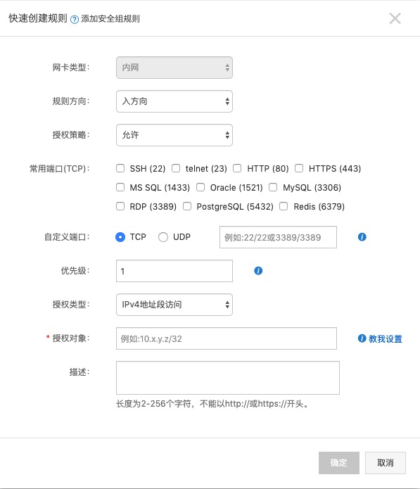

# 阿里云

## 使用指南
### 使用本地客户端远程连接
1. 在 阿里云 ECS 控制台，重置实例密码。
2. 采用 ssh root@IP 方式，输入密码后登录。

### 创建用户
```bash
# useradd -m sunny
# passwd sunny //修改密码
```

### 开通访问端口
1. 在 阿里云 ECS 控制台，打开 “网络与安全组” -》 “安全组配置” -》“配置规则” -》 “快速创建规则”


2. 配置防火墙
```md
CentOS 中防火墙程序主要是 firewall 和 iptables。
CentOS7 中firewall服务已经默认安装好了，而 iptables 服务需要自己用yum install iptabes-services来安装。
```
* firewall
```bash
# firewall-cmd --state // 查看防火墙状态
running

# systemctl  start   firewalld.service //开启
# systemctl  stop   firewalld.service  //关闭
# systemctl   disable   firewalld.service //禁止开机启动
```
如果防火墙开启的情况下，需要配置打开端口：
```bash
# firewall-cmd --add-port=8080/tcp --permanent //开放8080端口

# firewall-cmd --reload  //重新加载生效
```
```bash
# firewall-cmd --list-all //查看状态

# firewall-cmd --list-ports
# firewall-cmd --zone=public --list-ports //列出 public 的端口
8080/tcp 80/tcp
```
```bash
# firewall-cmd --remove-port=8056/tcp
```

### Q & A
#### 非 root 用户，无法绑定 80端口启动。
解决方案：
1. 通过防火墙来转发
```bash
firewall
# firewall-cmd --permanent --add-forward-port=port=80:proto=tcp:toport=8080
```
2. 通过 Nginx 转发
```md
可以部署一层 Nginx 作为接入层，绑定 80 端口，使用 root 账户启动。
再 通过 Nginx 的反向代理功能进行转发。
```
