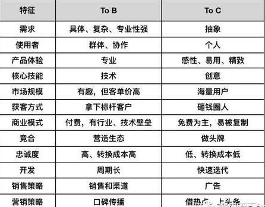

# To B 业务到底是什么？

To B 是指目标用户是企业的业务，本质是帮助企业提高生产效率。

一般来说，2B 业务分传统软件和 SaaS 两种模式

前者如企业销售管理工具、ERP、云平台；

后者近年较火，是把传统的 IT 能力云化后输出，企业无需采购软件，只需获得授权（账号等）即可获得服务，
如企业文档协同平台石墨文档、有道云笔记，团队协作工具 Teambition 等。

## To B 业务的核心逻辑是什么？

To B 的大部分产品是需要强大的市场销售体系的，  
商务需要与客户团队或公司的决策者或者业务负责人进行定向营销，决策者的需求满足情况决定了产品能否落地。

* 首先，企业的消费，除了有可见的购买成本，还有不可见的更高昂的维护和迁移成本。

因此整个过程是理性的、专业的、团队化决策的。
每次采购，涉及的关键角色很多，至少有使用方、评估方、预算方、拍板方、签字方共同参与。
不像个人消费，完全是个人决策，如在淘宝买一件衣服、安装一个 APP 等。

* 其次，
企业消费的决策过程，涉及的关键角色这么多，
如果见不到这些角色，就很难了解这个企业的真正业务需求和组织架构，也就无法有目标地推进项目。

当然了，B 端机构的决策是公司行为，而公司决策行为关系到非常多的利益方，是相当复杂的。 
这也决定了 To B 运营不可能像 To C 那样通过大数据、通过用户画像来运营。

* 最后，决策者在 To B 业务中是很重要的

## ToB vs ToC
### 不同
* 用户属性不同
* 客单价差异
* 产品推广方式不同

### 相同点
* B 端和 C 端的决策者都是人
* B 端和 C 端的决策者都在用相同的媒体

