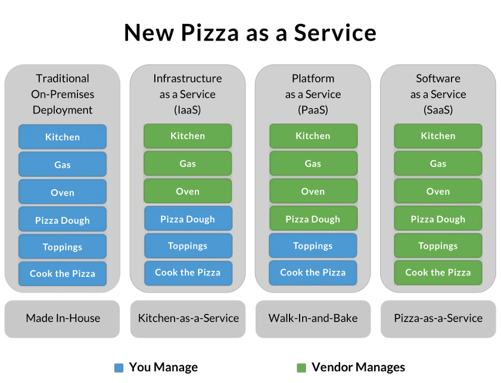
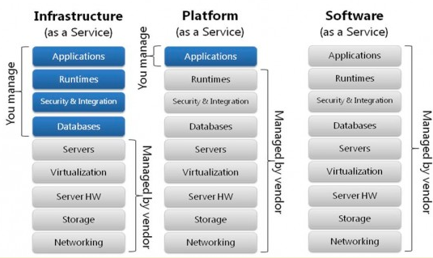
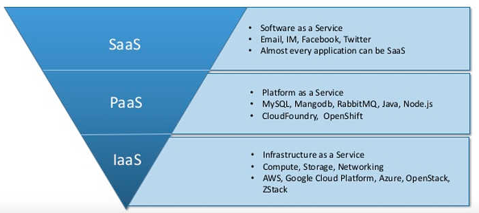
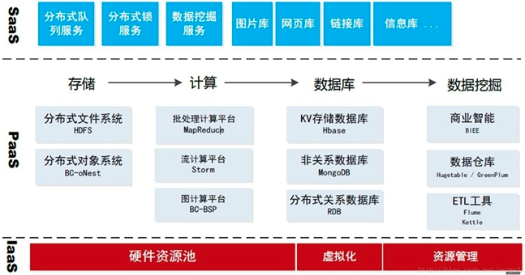

# 云服务

```md
* SaaS (Software as a Service 软件即服务)
* PaaS (Platform as a Service 平台即服务)
* IaaS (Infrastructure as a Service 基础设施即服务)

* BaaS (Backend as a Service 后端即服务)
服务商为客户(开发者)提供整合云后端的服务，
如提供文件存储、数据存储、推送服务、身份验证服务等功能，以帮助开发者快速开发应用。

* FaaS (Function as a service 函数即服务)
服务商提供一个平台，允许客户开发、运行和管理应用程序功能，
而无需构建和维护通常与开发和启动应用程序相关的基础架构的复杂性。 
按照此模型构建应用程序是实现“无服务器”体系结构的一种方式，通常在构建微服务应用程序时使用。
```

## 层级



## IaaS，PaaS，SaaS 的区别

```md
从左到右，自己承担的工作量（上图蓝色部分）越来越少，IaaS > PaaS > SaaS
```
***对应软件开发***

